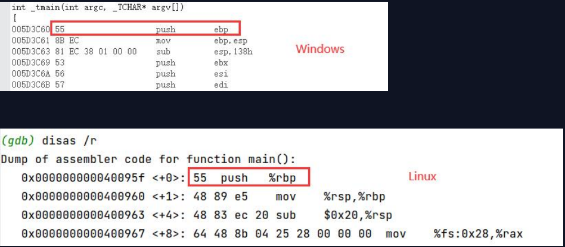
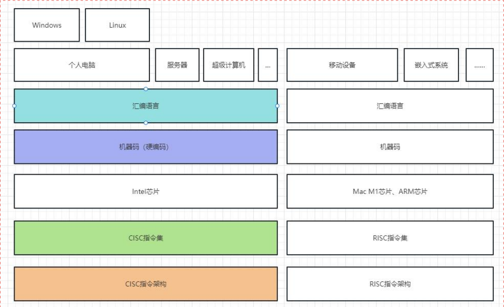

#记录os内核研究的实现过程。

## 学习汇编的程度
能够非常熟练的实现以下功能，表示能够熟练使用汇编
1. 熟练写出函数：无参无返回值、无参有返回值、有参有返回值
2. 声明变量：全局变量、局部变量
3. 实现运算：基本运算、位运算
4. 熟练实现条件判断
5. 熟练实现循环结构

## CPU 架构
- CISC（复杂指令集）
  1. Intel芯片
- RISC（精简指令集）
  1. ARM芯片
  2. Mac M1、M2芯片

## CPU架构与指令集
CPU架构（如CISC或RISC）和指令集（Instruction Set Architecture）之间的关系是非常紧密的。CPU架构实际上决定了指令集的设计 和实现，而指令集
则为CPU提供了执行任务所需的基本操作。

CISC(Complex Instruction Set Computing，复杂指令集计算)和RISC (Reduced Instruction Set Computing，精简指令集计算)是两种不同的CPU架
构设计理念，它们的主要区别在于处理器指令集的复杂性。

CISC架构倾向于使用较少的更复杂的指令，这些指令可能会在一条指令中完成多个操作，内存访问、算术运算和数据移动等。CISC架构的典型代表是intel的x86
架构，它的指令集中包含了大量的复杂指令。

相反，RISC架构使用了较多的简单指令，每条指令尽可能只完成一个操作相反，这样可以使得CPU更容易在一个时钟周期内完成一条指令，提高指令的执行速度、
RISC架构的典型代表是ARM和MIPS，它们的指令集设计比较简单。

所以，你可以理解为，CPU架构 (CISC或RISC)决定了指令集设计的总体策略，而指令集则是这种策略的具体实现。

## 指令集
指令集(Instruction Set Architecture，简称ISA)是CPU架构的一部分，它定义了CPU所能理解和执行的机器指令的集合。它是硬件和软件之间的接口，可
以看作是硬件提供给软件的服务和功能的规范。

指令集定义了以下内容:

1. 机器指令:所有CPU能执行的指令，包括算术运算、数据传输、逻辑操作、流程控制等
2. 数据类型:CPU可以处理的数据类型，包括整数、浮点数、向量等
3. 寄存器:CPU内部可用的寄存器，包括通用寄存器和特殊用途寄存器
4. 内存模型:如何与内存进行交互，如寻址模式、数据对齐规则等
5. 输入/输出:如何与外设进行通互，这通常通过一些特殊的指令或者内存映射I/O来完成。

RISC (Reduced Instruction Set Computing，精简指令集计算)和CISC (Complex Instruction SetComputing，复杂指令集计算)都是指令集设计的
理念。在RISC架构中，每条指令尽可能做的事情较少且简单，这样可以让CPU在单个时钟周期内完成更多的指令;而在CISC架构中，每条指今可以做更多且更复杂的
事情，从而在一定程度上减少了需要的指令数量。

比如ARM架构是RISC的代表，它的指令集简单，每条指令只做一件事情:而Intel的x86架构是CISC的代表，它的指令集比较复杂，每条指令可以做多件事情。
指令集对于程序员来说尤为重要，因为它决定了程序员(或编译器)可以用什么样的语言来编写程序，并影响着程序的性能和效率。

## 机器码（硬编码）与指令集
机器码和指令集之间的关系是非常紧密的。机器码是指令集的具体实现，是计算机能直接理解和执行的二进制代码。

指令集(Instruction Set Architecture，简称ISA)是硬件和软件之间的接口，定义了CPU支持的所有指令，包括数据类型、寄存器、内存模型、输入/输出等。
它描述了硬件应如何响应每种指令。

而机器码则是这些指令的具体二进制表示，即“机器语言”。每一个机器码对应指令集中的一条指令。当CPU读取到一个机器码，它会根据指令集去解析和执行这个代码。
例如，假设我们有一个非常简单的指令集，只包含两条指令:LOAD和ADD。LOAD用于从内存加载数据到寄存器，ADD用于将两个寄存器的内容相加。我们可以为这两条
指令分别分配一个机器码，比如，LOAD对应机器码“00”，ADD对应机器码“O1”。

那么，在这个例子中，如果CPU读取到一个机器码“00”，它就知道需要执行LOAD指令:如果读取到一个机器码“01”，它就知道需要执行ADD指令。
这只是一个简化的例子，实际的机器码会包含更多的信息，比如操作数、寄存器编号等。机器码的具体格式依赖于指令集的设计，不同的指令集会有不同的机器码格式。

## 相同CPU、不同OS，汇编不一样，机器码不一样


## CPU架构、指令集、汇编、硬编码之间的关系


## 寄存器、CPU缓存、内存之间的关系
寄存器、CPU缓存和内存都是计算机中的存储设备，它们的主要区别在于速度、大小和用途。

1. **寄存器**:寄存器是CPU内部的存储单元，它们是最快的存储设备。由于寄存器直接集成在CPU内部，CPU可以在一个时钟周期内从寄存器读取或写入数据。 
寄存器的数量和大小由CPU架构决定，通常数量非常有限。寄存器用于存储当前执行的指令所需的数据和计算结果，以及其他控制信息。
2. **CPU缓存**:CPU缓存是一种位于CPU和内存之间的快速存储设备，用于缓存内存中的数据，以减少CPU访问内存的时间。当CPU需要读取内存中的数据时，
它会首先查看这个数据是否在缓存中。如果在(这称为“缓存命中”)，CPU可以直接读取缓存中的数据，这比读取内存快得多。如果不在(这称为“缓存未命中”)，
CPU需要从内存读取数据，并将其缓存起来以备后用。CPU缓存的大小比寄存器大，但比内存小。
3. **内存**:内存(也称为主存或RAM)是一种大容量的存储设备，用于存储正在运行的程序和数据。内存的大小比寄存器和CPU缓存都大得多，但速度比它们慢。
当CPU需要执行一个程序时，这个程序会首先从硬盘加载到内存中，然后CPU从内存中读取指令和数据进行执行。

这三者之间的关系可以总结为: 寄存器最快但数量最少，主要用于当前指令的执行，CPU缓存的速度比寄存器慢，但比内存快，它作为寄存器和内存之间的缓冲，
提高了数据访问的效率;内存的速度最慢，但它提供了大量的存储空间，用于存储正在运行的程序和数据。

## CPU包含哪些寄存器

1. 通用寄存器
2. 段寄存器
3. 指令指针寄存器 EIP、RIP
4. 标准寄存器（状态寄存器）eflags、rflags
5. 控制寄存器（CR0 -- CR4，CR3页表）
6. 调试寄存器（DR0 -- DR7）
7. 描述符寄存器（GDTR、LDTR、IDTR）
8. 任务寄存器（TR）

汇编代码

```
while(true);的汇编代码如下
-----
mov eax, 1
test eax, eax
je wmain+29h	如果为0就跳到其他地方执行
jmp vmain+1Eh	如果不为0就跳回原地，也就是while循环
以上执行效率会比较低，直接执行

jmp $ 就完事了

寄存器的效率高低取决于代码的多少，代码越多效率越低。

.loop:
    jmp .loop
```

如何操作标志（状态）寄存器

由于无法像操作通用寄存器一样操作eflags寄存器，所以需要用这种间接的方式

虽然cli\sti可以直接修改eflags的IF位，那如果是其他位呢？所以这种方式还是要掌握

```
pushf		将eflags寄存器的值压入栈
pop eax 	出栈eax = eflags的值
bts eax, 9	将eflags的第9位，即IF位，置为1
push eax	压入栈
popf		赋值给eflags寄存器
```
    


